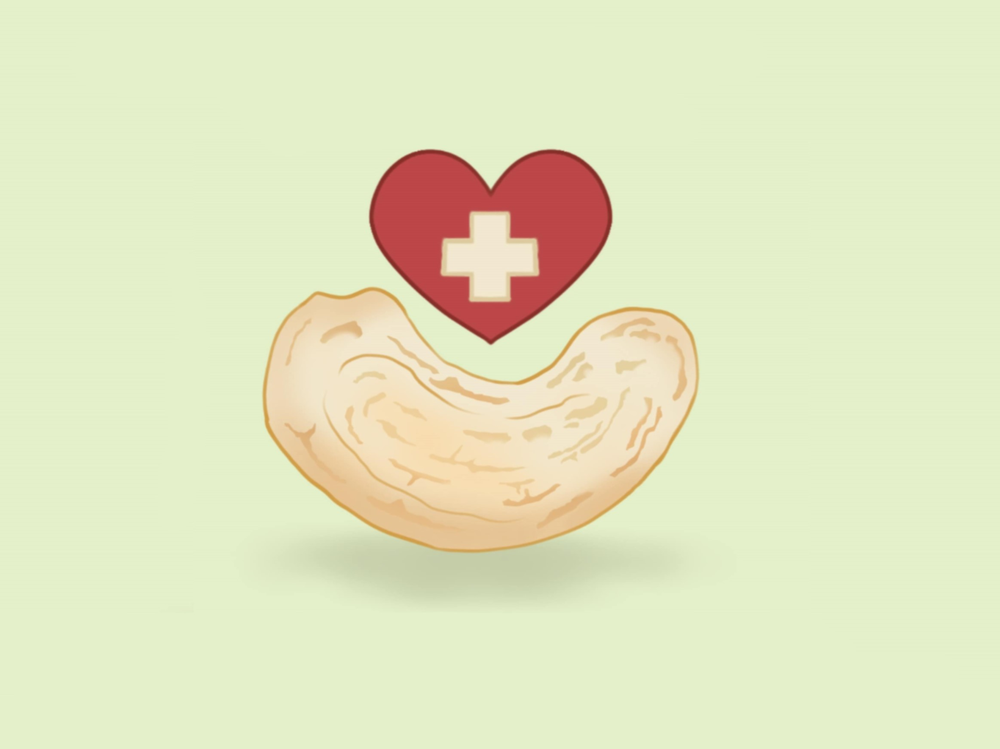

# Cashew - HackMIT 2024 - Track: Healthcare

**Cashew** keeps help close to you and your loved ones. By using sensory data from cellular device IMUs, Cashew is constantly monitoring to detect falls and contact the right support systems accordingly. With a personalized risk evaluation method and a community-based approach, Cashew brings together not just family but neighborhoods to protect each other. With Cashew, you need nut worry; we provide peace of mind, every step, every time.

## Figma Design

  
  
  

## Inspiration
Fall-related injuries are one of the leading causes of death in adults 65 and older in the US, and many of the medications used to treat age-related chronic illness can increase the risk of falling. Commercially available apps often require expensive external devices and lack a large network of connectivity. One of our team members worked in a retirement home and witnessed firsthand how in any medical emergency, timely response is crucial to improving patient outcomes. Each of us has an elderly family member or neighbor we worry about. Having an affordable, simple app with prompt notifications will help give us peace of mind for every step our elders take.

## What It Does
Cashew constantly monitors mobile phone sensor data (IMUs). It not only detects if a fall has occurred but also categorizes the severity depending on the patient’s prior medical history for a personalized care experience. Based on the severity index, the appropriate parties are contacted automatically after a 2-minute timer (to prevent false positives). If the necessary contact is unavailable, the app will iterate through the list of other closest available contacts and local emergency services. Additionally, neighbors within a close range will be notified to provide more immediate assistance. 

Cashew uses a random forest machine learning algorithm to analyze IMU sensor data and compare it with a database of fall data. The algorithm determines the severity of the fall by multiplying the error between the detected fall and historical data by the individual's personal risk factor.

## How We Built It
- **Front-end**: React Native with Expo, utilizing the Expo Sensors API to access phone sensor data.
- **Backend**: Flask to manage backend logic and integrate with the Random Forest machine learning algorithm.
- **Machine Learning Model**: Random Forest algorithm for fall detection and severity analysis.
- **Database**: SQLite to store sensor data and user profiles.

## Challenges We Ran Into
- This was the first hackathon for most of our team, and it took us a while to get started. Half of our team comes from an engineering background, not CS/software, so we spent the first 6 hours figuring out how to approach the project.

## Accomplishments We're Proud Of
- Implementing real-time phone IMU monitoring and fall detection logic.
- Developing a personalized fall severity system.

## What We Learned
We learned how to:
- Read and access built-in sensor data from mobile devices in real time.
- Analyze and interpret that data to create a user-friendly platform.

## What's Next for Cashew
- Implement a more robust fall risk evaluation system, similar to medical assessments like the Morse Fall Scale.
- Include factors such as previous medical history, sex, location, and a wider range of medications.
- Improve user experience, especially for elderly users, with a seamless setup process.
- Integrate external devices like smart home cameras and wearables for enhanced monitoring.

## Project Links
- [Figma Design](https://www.figma.com/proto/nO50o3EIhfMmMAUltl8GZZ/cashew-UI-mockup-(HackMIT-2024)?node-id=1050-343&starting-point-node-id=1047%3A83&t=4hBNHhnrZSArePwQ-1)
- [Google Slides Presentation](https://docs.google.com/presentation/d/1DLTrhjBdl3nRaHSWc6OO-SjhlY99dw9F7HzeM057OdY/edit?usp=sharing)
- [Video Demo](https://youtu.be/6hSDJUp0iyw)

## Team Members
- Aditi Bhattamishra ([aditibmishra@gmail.com](mailto:aditibmishra@gmail.com))
- Nahreen Shamon Ayala ([nayala7@gatech.edu](mailto:nayala7@gatech.edu))
- Khanh Khuat ([lankhanh1504@gmail.com](mailto:lankhanh1504@gmail.com))
- Yu Wati Nyi ([nyi22y@mtholyoke.edu](mailto:nyi22y@mtholyoke.edu))

## Repository
[GitHub Link](https://github.com/KhanhKhuat1504/Cashew)